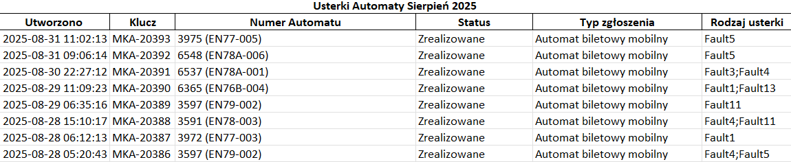
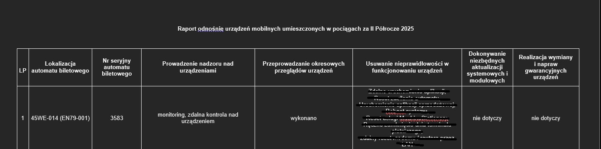

# Generator Raportów Serwisowych Automatów Biletowych

## Opis Projektu
Aplikacja służy do automatyzacji procesu tworzenia okresowych raportów (np. półrocznych) dotyczących utrzymania i awaryjności automatów biletowych. Narzędzie przetwarza dane wyeksportowane z systemu zgłoszeń (Jira) w formacie Excel, agreguje informacje o usterkach dla poszczególnych urządzeń, a następnie generuje gotowe raporty w formacie MS Word (.docx), wypełniając odpowiednie szablony.

System obsługuje dwa typy raportów:
1.  **Urządzenia stacjonarne** (terenowe).
2.  **Urządzenia mobilne** (zainstalowane w pociągach).

## Przykładowe działanie

### 1. Dane wejściowe (Excel)
Aplikacja pobiera surowe dane z systemu Jira, zawierające identyfikatory maszyn oraz kody błędów.

### 2. Wynik (Raport Word)
Skrypt automatycznie przypisuje rozwiązania do usterek i generuje sformatowaną tabelę w pliku .docx.

## Struktura Projektu

* **`app.py`**: Główny skrypt sterujący. Inicjalizuje proces, zarządza listą plików wejściowych, wywołuje przetwarzanie danych z Excela i steruje wypełnianiem dokumentów Word.
* **`excel.py`**: Moduł odpowiedzialny za operacje na plikach Excel. Zawiera funkcje do wczytywania danych (`open_excel`), zliczania usterek (`count_failures`) oraz łączenia danych z wielu plików (`merge_failure_dicts`).
* **`transform.py`**: Skrypt pomocniczy służący do transformacji lub anonimizacji danych wejściowych. Mapuje surowe dane (np. poufne nazwy błędów) na zdefiniowane kody (np. "Fault1", "Fault2").
* **`failure_solution_dict.py`**: Plik zawierający słownik mapujący rodzaje usterek (np. 'Awaria automatu') na podjęte działania naprawcze (np. 'Reboot systemu').
* **`word.py`**: (Wymagany moduł pomocniczy) Wrapper dla biblioteki `python-docx`, służący do otwierania, edycji i zapisywania plików Word.

## Wymagania

Aby uruchomić projekt, potrzebny jest Python 3.x oraz następujące biblioteki:

* `pandas` –